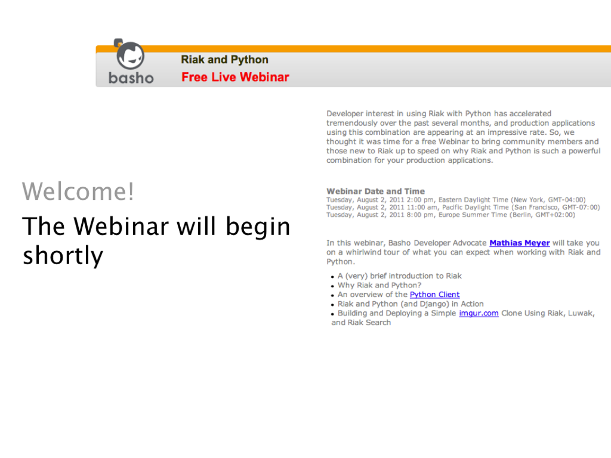

!SLIDE center

!SLIDE 

# Webinar: Riak and Python #

!SLIDE bullets 

# Agenda

* Using the Python Client
* New Features
* Django Integration
* Code!

!SLIDE bullets incremental

# Why Python? #

* Long History at Basho
* Language of Choice for Several Internal Tools
* One of the Earliest Supported Languages
* More and More Pythonistas Discover Riak

!SLIDE bullets incremental

# Why Riak and Python? #

* Scalable
* Distributed
* Fault-tolerant

!SLIDE bullets incremental

# Use cases #

* Scalable Session Store
* Scalable Full Text Search
* File Storage (Luwak)

!SLIDE bullets incremental

# Getting Started #

* [Download](http://downloads.basho.com/riak-search/CURRENT/) and install Riak Search
* Install the Riak Python client:
* `pip install riak`

!SLIDE bullets incremental

# The Python Client #

* Protocol Buffers and HTTP
* MapReduce Support
* Search Built in

